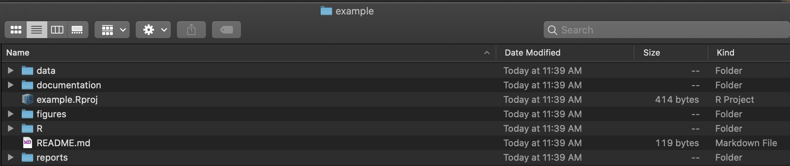

# Project: dsproject

## Author: Cher Qin

## Date: November 05 2020

## Purpose: 
The purpose of this package is help set up a project directory with subdirectories and a README.md in one function. There are two addition functions that may come to use in making the project.

## Download
This package can be installed by using `install.pacakge("dsproject")` and called using `library(dsproject)`.

## Lience: MIT

